# 从0-1部署web项目（华为云）

## 服务器的选择

比较大的服务器厂商：`阿里云`、`腾讯云`、`华为云`、`京东云`、`百度云`

 阿里云是国内做得最好，并且用户数量最多的厂商，不考虑money，首先考虑这个，份额第二就是腾讯云，属于后起之秀，价格相对阿里云会便宜一些。华为云一些政府机构、高校很多都在使用；其他的云服务厂商技术上均没有阿里云、腾讯云好，但是价格便宜一些。我这项目中我使用的是华为云，华为云有个新人用户优惠，36一年，先试用一年，后面再白嫖其他厂商。

## 服务器配置

### 1、配置安全组具体步骤

***进入步骤规则 -->  添加规则 -->  填写规则  -->  确定***

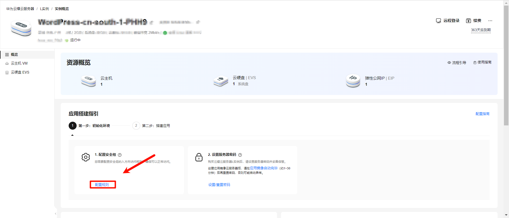

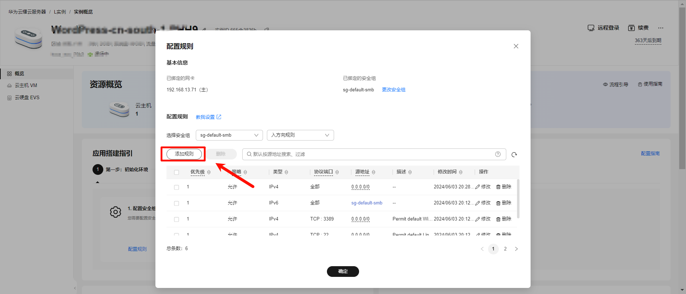

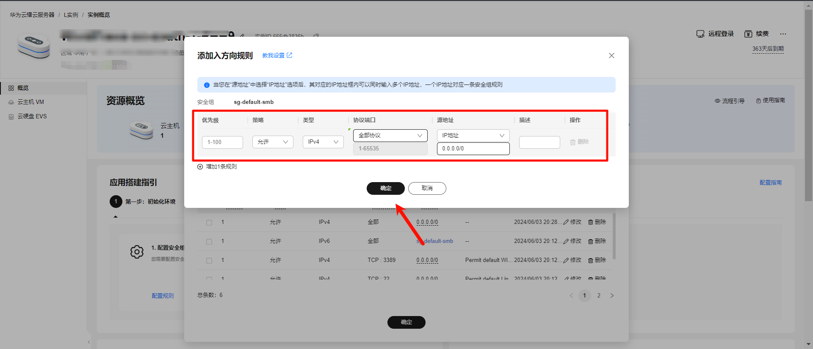


### 2、重新设置服务器密码

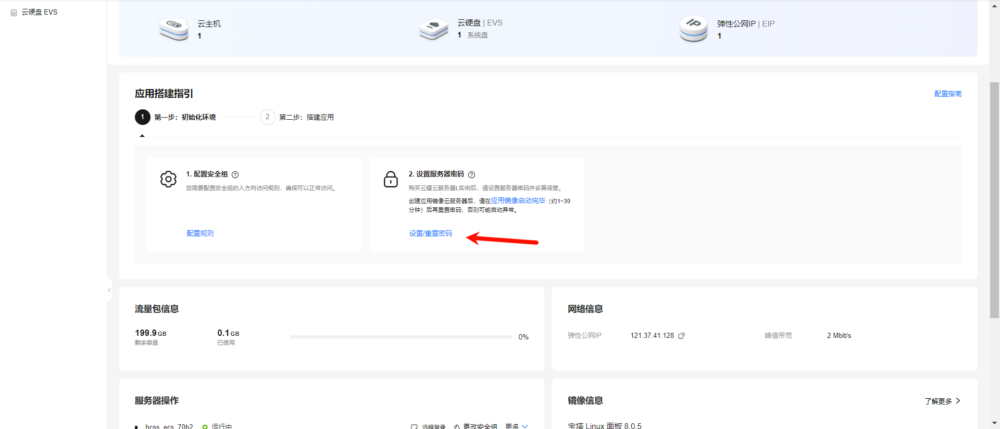

### 3、重新启动服务器

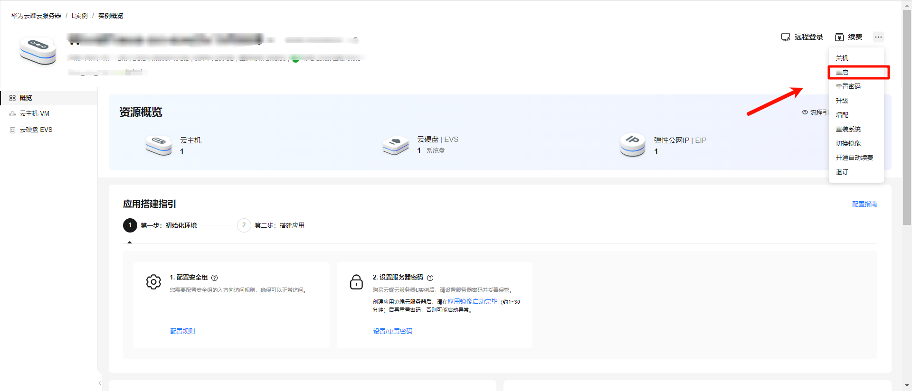


## Xshell 下载与配置

### 1、下载Xshell

>Xshell 是一款功能强大的终端模拟软件，主要用于远程访问和管理Linux或Unix服务器。

下载地址：https://www.xshell.com/zh/free-for-home-school/

默认安装，不写具体安装步骤

安装软件教程：https://blog.csdn.net/m0_67400972/article/details/125346023

### 2、配置Xshell，连接服务器

***新建连接 -->  配置连接，确定 --> 点击（一次性接受）   -->  输入华为云上密码，确定 -->窗口上红点变成绿色，说明是成功了***

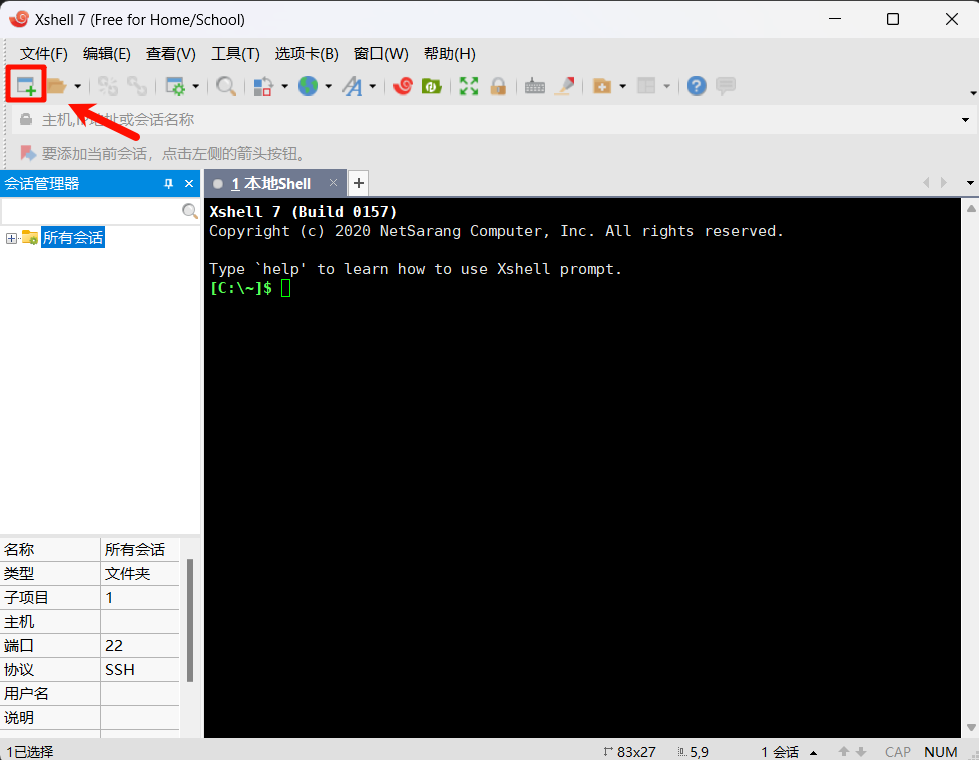

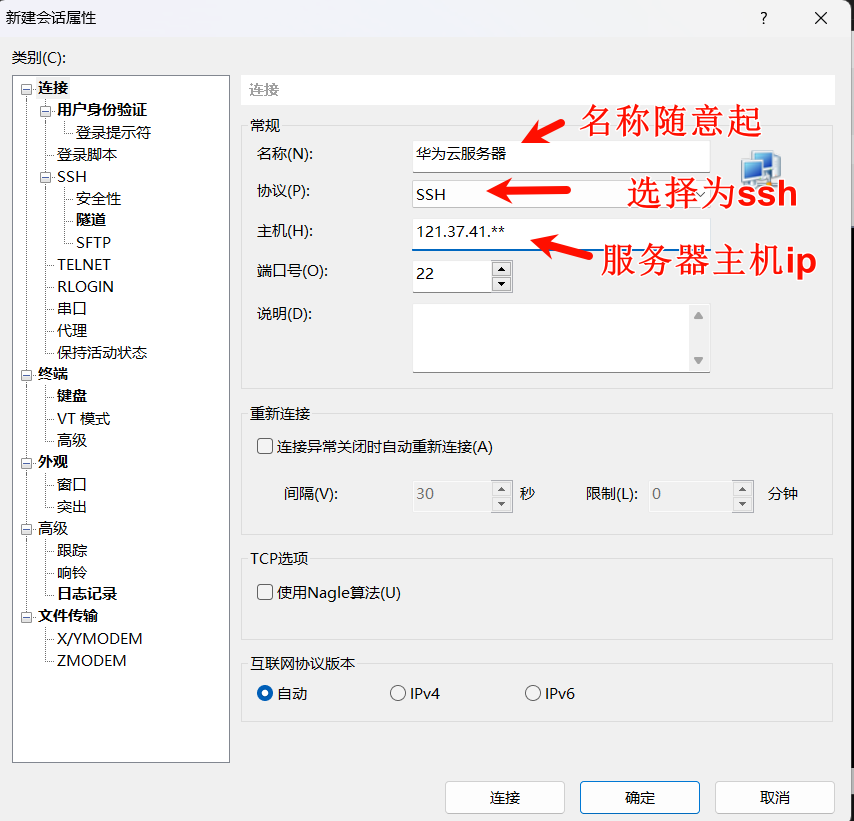

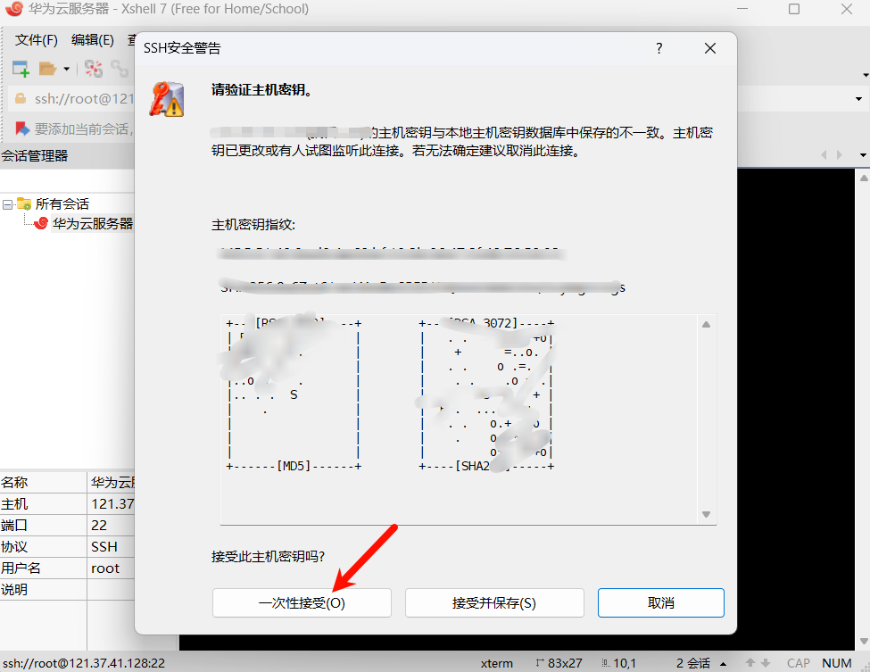

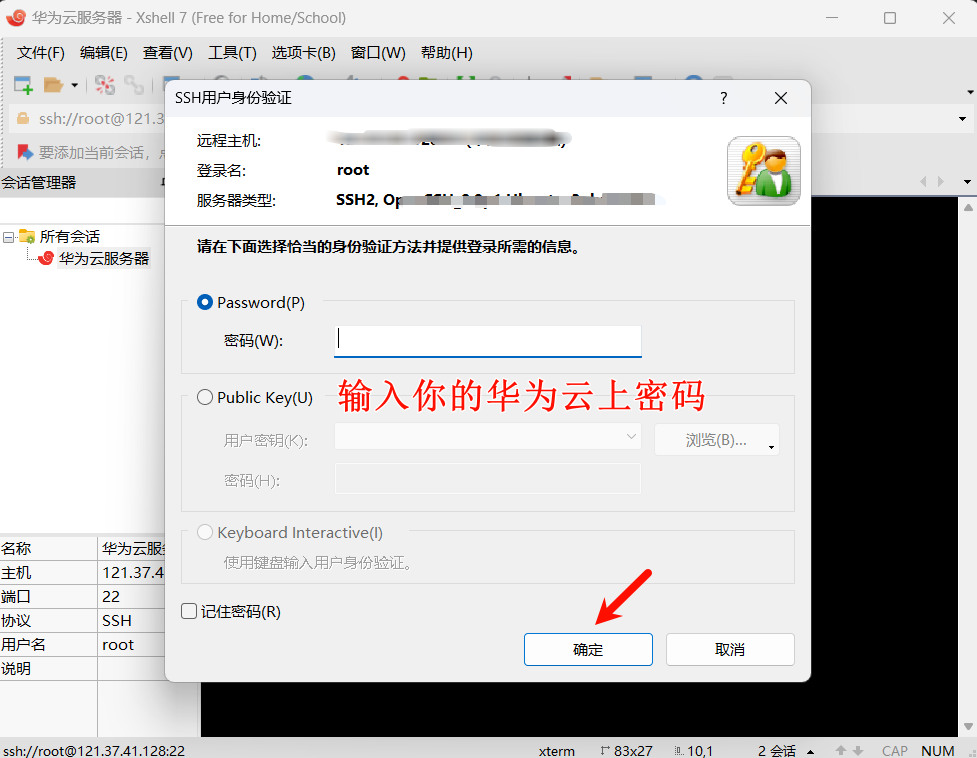

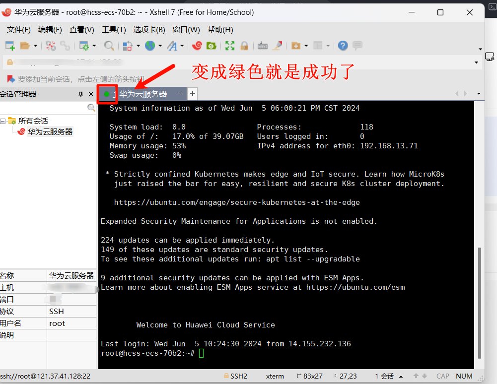

## Xftp 下载与配置

### 1、下载Xftp

>Xftp  Xftp是一款专为Windows操作系统设计的强大SFTP和FTP文件传输软件，具有更直观界面，使得文件传输操作简单。

下载地址：https://www.xshell.com/zh/free-for-home-school/

默认安装，无脑操作

### 2、配置Xftp，连接服务器

***新建连接 -->  配置连接，确定 --> 连接成功***

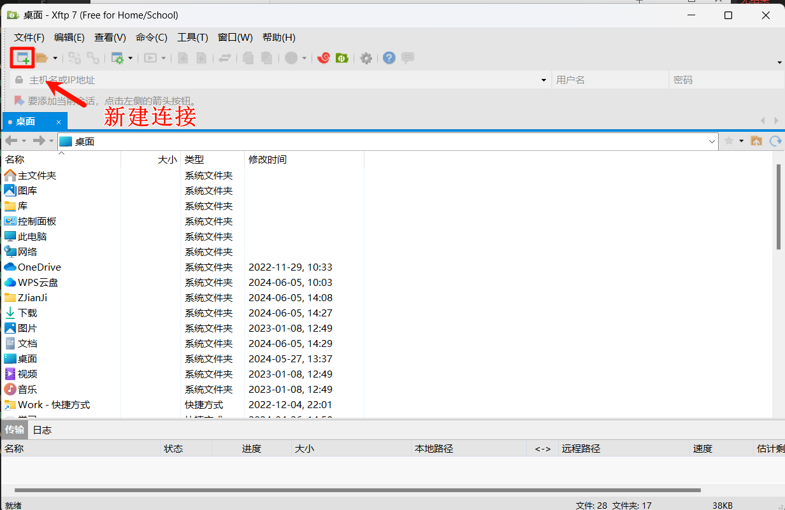

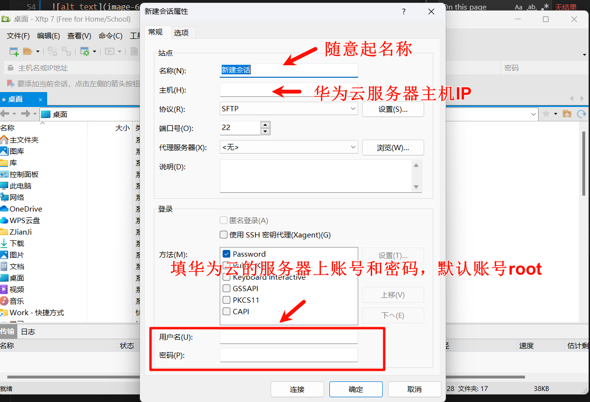

## Nginx的环境配置(在Xshell中操作)

***1、安装nginx***

```md
sudo apt install nginx
```

***2、启动并启用 Nginx***

```md
sudo systemctl start nginx
sudo systemctl enable nginx
```

***3、创建目标目录***

```md
sudo mkdir -p /var/www/mywebsite
```

***4、编辑 mywebsite 配置文件***

```md
sudo nano /etc/nginx/sites-available/mywebsite
```


***5、编辑 mywebsite 配置文件-添加以下内容***

```md
server {
    listen 80;
    server_name your_domain_or_ip;

    root /var/www/mywebsite;
    index index.html index.htm index.php;

    location / {
        try_files $uri $uri/ =404;
    }

    # 配置 PHP 支持（如果需要）
    location ~ \.php$ {
        include snippets/fastcgi-php.conf;
        fastcgi_pass unix:/var/run/php/php7.4-fpm.sock;
    }
}
```


***6、创建符号链接***

```md
sudo ln -s /etc/nginx/sites-available/mywebsite /etc/nginx/sites-enabled/
```


***7、测试 Nginx 配置并重启服务***

```md
sudo nginx -t
sudo systemctl restart nginx
```

***8、配置防火墙,允许 HTTP 和 HTTPS 流量***

```md
sudo ufw allow 'Nginx Full'
```


## 将网站文件上传到服务器上

1、上传文件到 /var/www/mywebsite

2、使用 Xftp 工具进行上传
